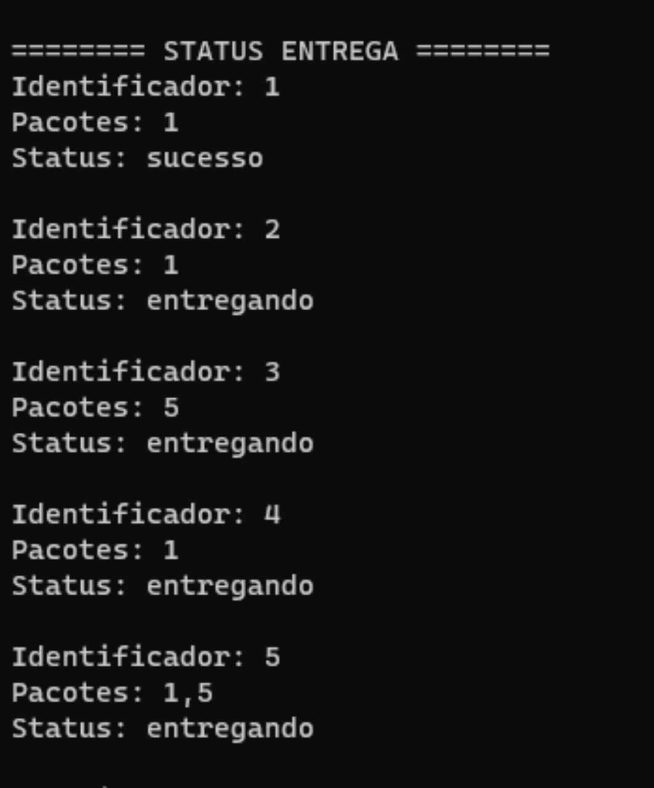
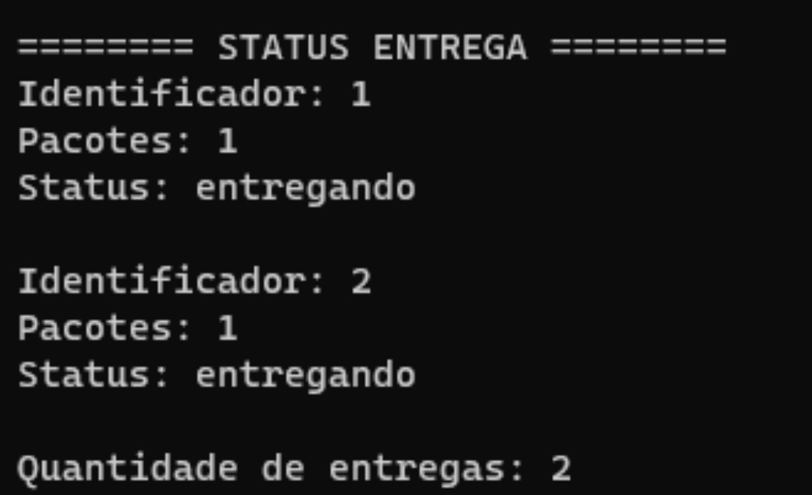

# Jão Delivery

**Disciplina**: FGA0210 - PARADIGMAS DE PROGRAMAÇÃO - T01 <br>
**Nro do Grupo**: 05<br>
**Paradigma**: Funcional<br>

## Alunos
|Matrícula | Aluno |
| -- | -- |
| 180041592  |  Denys Rogeres Leles dos Santos |
| 180113259  |  Felipe Correia Andrade |
| 180103580  |  Jonathan Jorge Barbosa Oliveira|
| 180125885  |  Lucas Melo dos Santos |
| 180127535  |  Mateus Brandao Teixeira |
| 180106821  |  Mateus Gomes do Nascimento |
| 180127641  |  Matheus Afonso de Souza |
| 180138545  |  Thiago Mesquita Peres Nunes de Carvalho |
| 180132245  |  Vinicius de Sousa Saturnino |

## Sobre 
Este software é um sistema de envio de mercadorias onde pessoas podem enviar seus pacotes da forma mais ágil acompanhando a trajetoria e o status deles até o destinatário. 


## Screenshots


## Instalação 
É necessário instalar as seguintes ferramentas para rodar o programa:
- GHC
- cabal-install
- stack
- haskell-language-server(opcional)
  
Para instalar, basta seguir o tutorial disponível no [site do Haskell](https://www.haskell.org/downloads/), e em seguida, entrar no diretório do projeto e executar o seguinte comando no terminal:

```bash
make run
```

**Linguagens**: Haskell<br>
**Tecnologias**: Haskell<br>

## Uso 
Entre no software, e cadestre seu pacote a partir do menu de cadastro (opção "1"). Após isso, vá para a entrega (opção "2"), onde será selecionando os pacotes que serão entregues. Com isso é possível verificar o status de entrega no menu de "entrega" (opção "3"). E o status da mercadoria pode ser alterado para "Sucesso" (Produto entregue com sucesso), "Falha" (Produto entregue com falha) ou "Cancelar" (Cancelar a entrega do produto).





## Vídeo
Adicione 1 ou mais vídeos com a execução do projeto.
Procure: 
(i) Introduzir o projeto;
(ii) Mostrar passo a passo o código, explicando-o, e deixando claro o que é de terceiros, e o que é contribuição real da equipe;
(iii) Apresentar particularidades do Paradigma, da Linguagem, e das Tecnologias, e
(iV) Apresentar lições aprendidas, contribuições, pendências, e ideias para trabalhos futuros.
OBS: TODOS DEVEM PARTICIPAR, CONFERINDO PONTOS DE VISTA.
TEMPO: +/- 15min

## Participações
Apresente, brevemente, como cada membro do grupo contribuiu para o projeto.
|Nome do Membro | Contribuição | Significância da Contribuição para o Projeto (Excelente/Boa/Regular/Ruim/Nula) |
| -- | -- | -- |
| Denys Rogeres Leles dos Santos  |  --- | --- |
| Felipe Correia Andrade  |  --- | --- |
| Jonathan Jorge Barbosa Oliveira  |  Implementação do fluxo de criar pacote, verificar pacote, formatar as entradas e saídas dos dados, criação de entrega e criação dos dados para popular o grafo. | Excelente |
| Lucas Melo dos Santos  |  --- | --- |
| Mateus Brandao Teixeira  |  --- | --- |
| Mateus Gomes do Nascimento  |  Implementação do fluxo de criar entrega, verificar entrega, finalizar entrega, atualizar status das entregas e pacotes, dos menus e da listagem de pacotes e entregas. | Excelente |
| Matheus Afonso de Souza  |  Implementação da estrutura do grafo, do algoritmo de Dijkstra, do fluxo de calcular melhor rota, das funções de leitura e escrita em arquivos, dos menus, do cadastro de novos pacotes, da verificação de pacotes e da criação dos dados para popular o grafo. | Excelente |
| Thiago Mesquita Peres Nunes de Carvalho  |  Implementação do fluxo de criar entrega, verificar entregas, finalizar entrega, da listagem de pacotes e entregas e menus. | Excelente |
| Vinicius de Sousa Saturnino  |  Implementação do fluxo de criar pacote, verificar pacotes, dos menus e da repetição de escolhas do usuário | Excelente |

## Outros 
Quaisquer outras informações sobre o projeto podem ser descritas aqui.
(i) Lições Aprendidas;
(ii) Percepções;
(iii) Contribuições e Fragilidades, e
(iV) Trabalhos Futuros.

## Fontes
Referencie, adequadamente, as referências utilizadas.
Indique ainda, fontes de leitura complementares.
