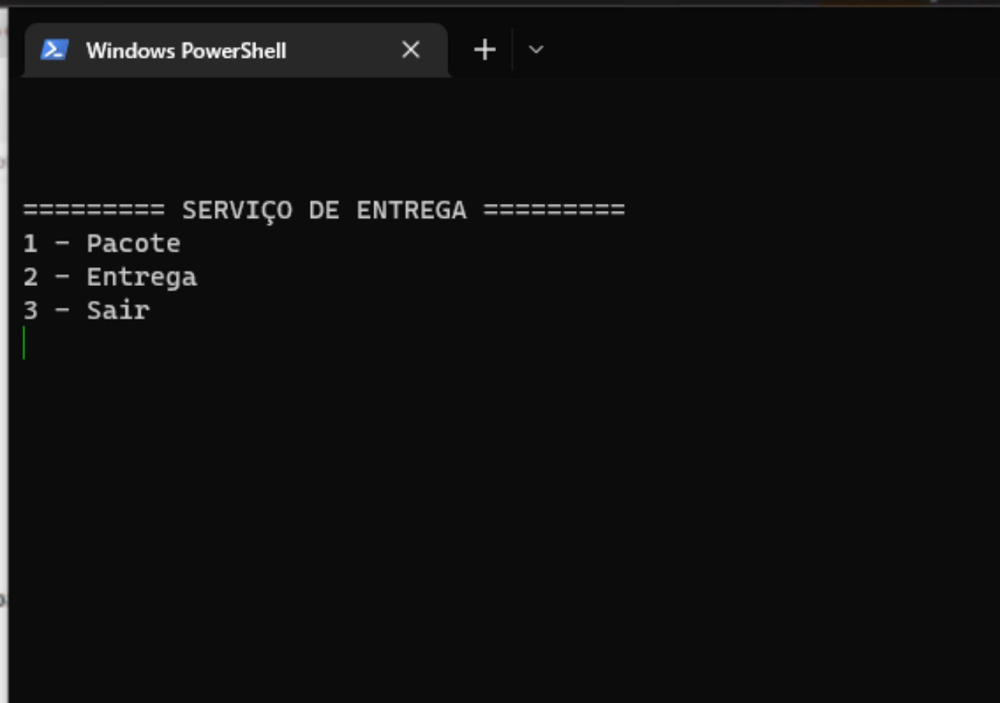
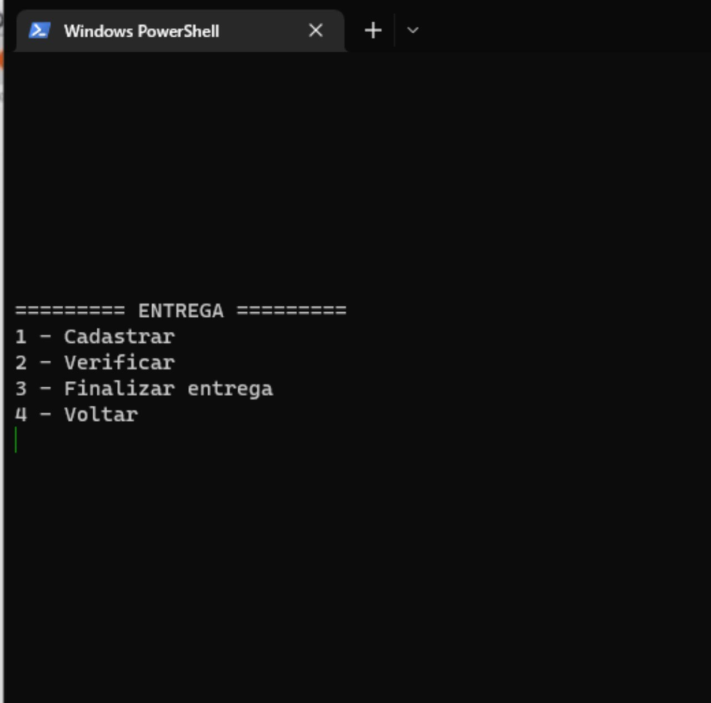

# RepositorioTemplate
Esse repositório é para ser utilizado pelos grupos como um template inicial, da home page do Projeto.
As seções do Template NÃO DEVEM SER OMITIDAS, sendo TODAS RELEVANTES.

Paradigmas:
 - Funcional
 - Logico
 - SMA

# Jao_Delivery

**Disciplina**: FGA0210 - PARADIGMAS DE PROGRAMAÇÃO - T01  
**Nro do Grupo**: 05 
**Paradigma**: Funcional 

## Alunos
|Matrícula | Aluno |
| -- | -- |
| 180041592  |  Denys Rogeres Leles dos Santos |
| 180113259  |  Felipe Correia Andrade |
| 180103580  |  Jonathan Jorge Barbosa Oliveira|
| 180125885  |  Lucas Melo dos Santos |
| 180127535  |  Mateus Brandao Teixeira |
| 180106821  |  Mateus Gomes do Nascimento |
| 180127641  |  Matheus Afonso de Souza |
| 180138545  |  Thiago Mesquita Peres Nunes de Carvalho |
| 180132245  |  Vinicius de Sousa Saturnino |

## Sobre 
Este software é um sistema de envio de mercadorias onde pessoas podem enviar seus pacotes da forma mais ágil acompanhando a trajetoria e o status deles até o destinatário. 

## Screenshots

## Instalação 
**Linguagens**: Haskell 
**Tecnologias**: xxxxxx 
Descreva os pré-requisitos para rodar o seu projeto e os comandos necessários.
Insira um manual ou um script para auxiliar ainda mais.
Gifs animados e outras ilustrações são bem-vindos!

## Uso 
Entre no software, e cadestre seu pacote a partir do menu de cadastro (opção "1"). Após isso, vá para a entrega (opção "2"), onde será selecionando o pacote e seu respectivo destinatário. Com isso é possível verificar o status de entrega no menu de "entrega" (opção "2"). E o status da mercadoria pode ser alterado para "Sucesso" (Produto entregue com sucesso), "Falha" (Produto entregue com falha) ou "Cancelar" (Cancelar a entrega do produto).

## Vídeo
Adicione 1 ou mais vídeos com a execução do projeto.
Procure: 
(i) Introduzir o projeto;
(ii) Mostrar passo a passo o código, explicando-o, e deixando claro o que é de terceiros, e o que é contribuição real da equipe;
(iii) Apresentar particularidades do Paradigma, da Linguagem, e das Tecnologias, e
(iV) Apresentar lições aprendidas, contribuições, pendências, e ideias para trabalhos futuros.
OBS: TODOS DEVEM PARTICIPAR, CONFERINDO PONTOS DE VISTA.
TEMPO: +/- 15min

## Participações
Apresente, brevemente, como cada membro do grupo contribuiu para o projeto.
|Nome do Membro | Contribuição | Significância da Contribuição para o Projeto (Excelente/Boa/Regular/Ruim/Nula) |
| -- | -- | -- |
| Fulano  |  Programação dos Fatos da Base de Conhecimento Lógica | Boa |

## Outros 
Quaisquer outras informações sobre o projeto podem ser descritas aqui.
(i) Lições Aprendidas;
(ii) Percepções;
(iii) Contribuições e Fragilidades, e
(iV) Trabalhos Futuros.

## Fontes
Referencie, adequadamente, as referências utilizadas.
Indique ainda, fontes de leitura complementares.
